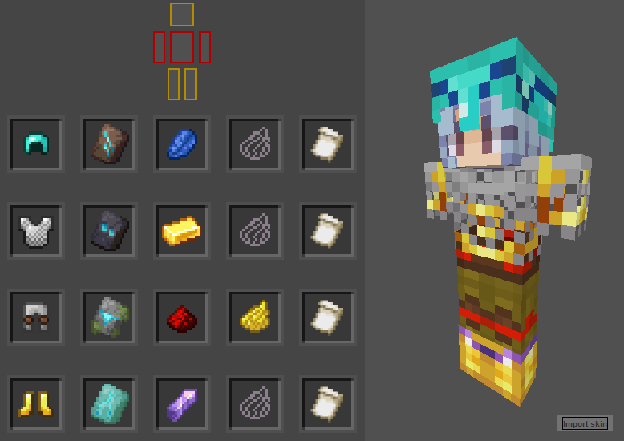

	
	 
	<h1 style="font-size:30px">Armorer's Stuff</h1>
	
	 
	
	
	

#### Armorer's Stuff

Import your skin, select different armor sets and choose your favorite one.

------------

Here's a preview:

